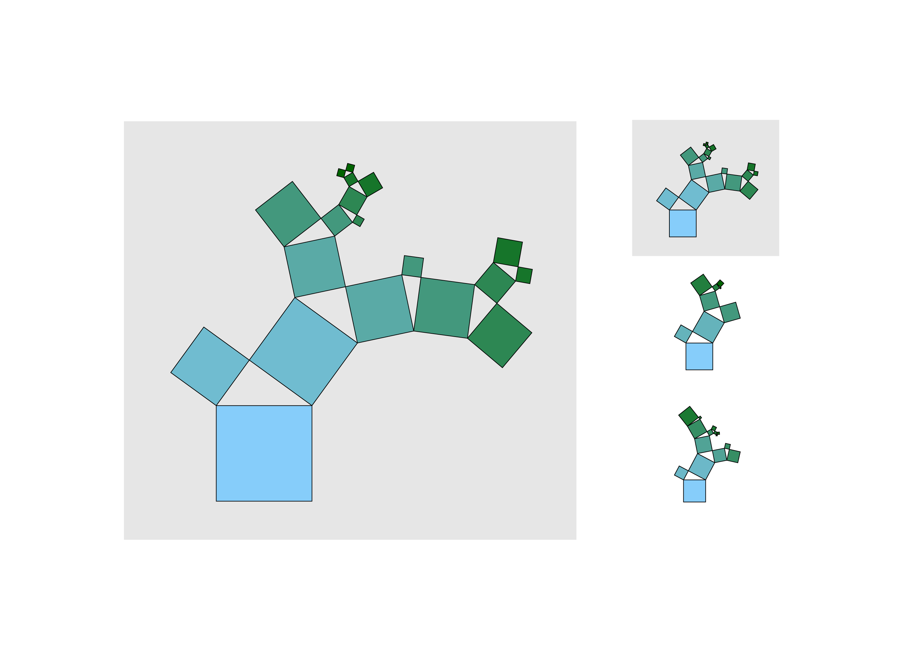

# PythagoreanForest
PythagoreanForest is a MATLAB implementation of the Pythagorean Forest which displays learned decision tree models from Random Forest as Pythagoras trees.

The Pythagorean Forest is described in:

P. G. Poličar, "Pitagorejska drevesa za vizualizacijo klasifikacijskih in regresijskih dreves," Univerza v Ljubljani, 2016.

usage:

```matlab
call_PythagoreanForest()
```

Cite As

C. B. Nzakimuena, "Automated analysis of retinal and choroidal OCT and OCTA images in AMD," Polytechnique Montréal, 2020


